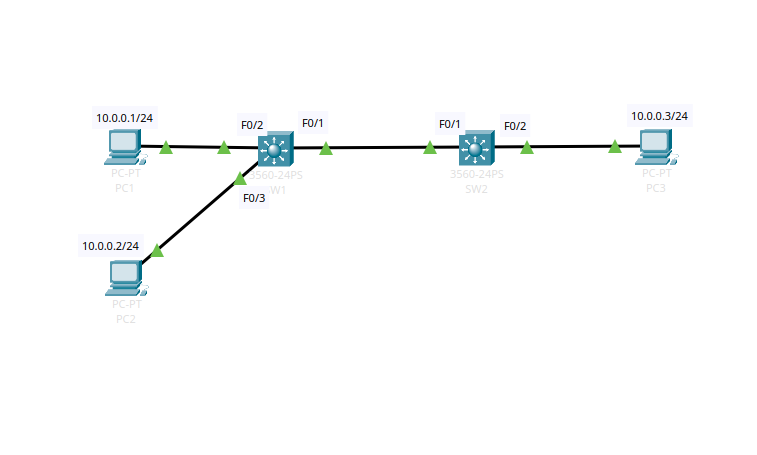

# 002 – Single VLAN Across Two Switches (Trunking Lab)

Real-hardware lab • Cisco Catalyst 3560-24PS + 2960-24PS • 802.1Q trunking



### Goal
- Put PC2 and PC3 in **VLAN 2** (10.0.0.0/24)  
- PC1 stays in default VLAN 1 (10.0.1.0/24)  
- PC2 ↔ PC3 can ping across the two switches  
- PC1 cannot reach PC2 or PC3 (Layer-2 isolation)  
- Prove that a properly configured **802.1Q trunk** is required between switches

### Equipment
- SW1: Cisco Catalyst 3560-24PS  
- SW2: Cisco Catalyst 2960-24PS  
- 3 Windows/Linux PCs with static IPs

### Key Skills Demonstrated
- Creating VLANs and naming them  
- Access port assignment  
- Fixing the classic 2960/3560 error  
  `Command rejected: An interface whose trunk encapsulation is "Auto"...`  
- Correct order: `switchport trunk encapsulation dot1q` → `switchport mode trunk`  
- Restricting allowed VLANs on trunk  
- Real troubleshooting captured in console log

### Final Configuration

**SW1 (3560)**
```
vlan 2
 name LAB_VLAN
exit

interface FastEthernet0/1
 description TRUNK TO SW2
 switchport trunk encapsulation dot1q
 switchport mode trunk
 switchport trunk allowed vlan 2
exit

interface FastEthernet0/3
 description PC2
 switchport mode access
 switchport access vlan 2
 spanning-tree portfast
exit
```

**SW2 (2960)**
```
vlan 2
 name LAB_VLAN
exit

interface FastEthernet0/1
 description TRUNK TO SW1
 switchport trunk encapsulation dot1q
 switchport mode trunk
 switchport trunk allowed vlan 2
exit

interface FastEthernet0/2
 description PC3
 switchport mode access
 switchport access vlan 2
 spanning-tree portfast
exit
```

**Verification**
``
textPC2 (10.0.0.20) → ping PC3 (10.0.0.30)      Success
PC1 (10.0.1.10) → ping PC2 (10.0.0.20)      Timeout → VLAN isolation works
PC1 → PC3                                   Timeout → expected
``
